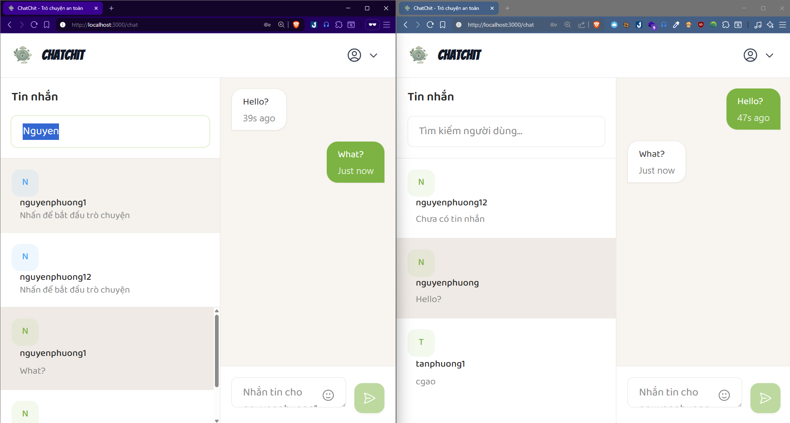

# ChatChit

A end-to-end encrypted messaging application built with Go (Gin framework) backend and React frontend. Features real-time messaging with WebSocket connections and secure user authentication.

## 🚀 Features

- **End-to-End Encryption**: Messages are encrypted on the client side for maximum security
- **Real-time Messaging**: Instant messaging using WebSocket connections
- **User Authentication**: Secure JWT-based authentication system

## 🛠️ Tech Stack

### Backend
- **Go** with **Gin** framework
- **WebSocket** for real-time communication
- **JWT** for authentication
- **MySQL** database
- **Docker** for containerization

### Frontend
- **React** 18
- **Tailwind CSS** for styling
- **Axios** for HTTP requests
- **Crypto-js** for encryption
- **React Router** for navigation

## 📋 Prerequisites

Before running this application, make sure you have the following installed:

- [Go](https://golang.org/doc/install) (version 1.23+)
- [Node.js](https://nodejs.org/) (version 16+)

## 📁 Project Structure

```
ChatChit/
├── backend/                 # Go backend application
│   ├── cmd/server/         # Application entry point
│   ├── internal/           # Private application code
│   │   ├── delivery/       # HTTP handlers and WebSocket
│   │   ├── domain/         # Business logic and models
│   │   ├── infra/          # Infrastructure layer
│   │   └── usecase/        # Use cases/business logic
│   ├── pkg/                # Public packages
│   └── docker-compose.yml  # Database setup
└── frontend/               # React frontend application
    ├── src/
    │   ├── components/     # React components
    │   ├── context/        # React context providers
    │   ├── pages/          # Page components
    │   ├── services/       # API services
    │   └── utils/          # Utility functions
    └── public/             # Static files
```

## 🔐 Security Features

- **End-to-End Encryption**: Messages are encrypted using AES encryption before being sent
- **JWT Authentication**: Secure token-based authentication
- **Password Hashing**: User passwords are securely hashed
- **CORS Protection**: Proper CORS configuration for API security

## 🙏 Acknowledgments

- Thanks to the Go and React communities for the excellent frameworks
- Inspiration from modern messaging applications
- Contributors who helped improve this project
- Special thanks to ChatGPT, Gemini, GitHub Copilot, and other AI tools for code suggestions and improvements
